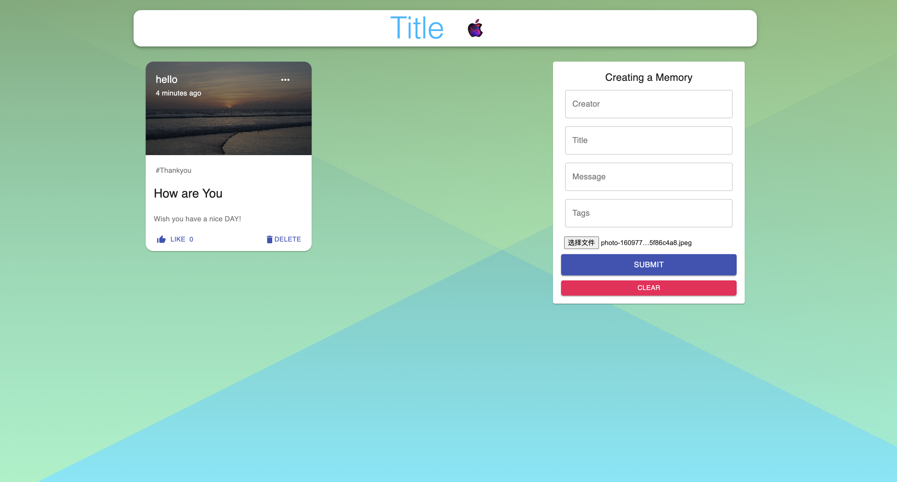

### start a new demo to practice MERN

---

#### Overview

> With this project, a full-stack project was implemented. The main technology stacks used are: react, redux, express mongodb。

#### Prerequisites

> [MongoDB Community](https://docs.mongodb.com/manual/administration/install-community/) needs to be installed locally.

#### How to start this Project

- start the client

```shell
cd mern-demo
cd client
yarn
yarn start
```

- start the server

```shell
cd ..
cd server
yarn
yarn start
```

#### Then you will see below at `http://localhost:3000`


